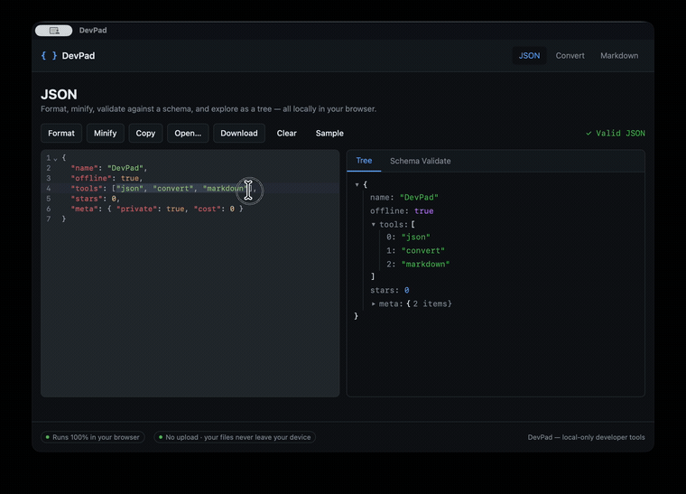
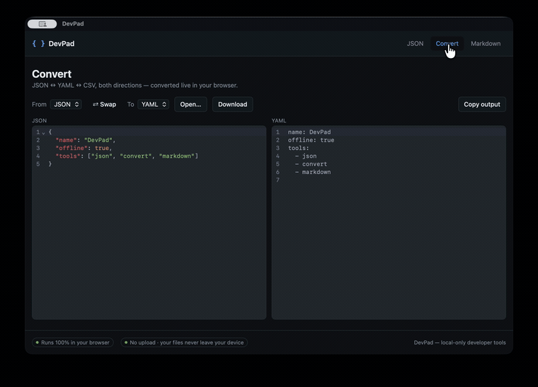
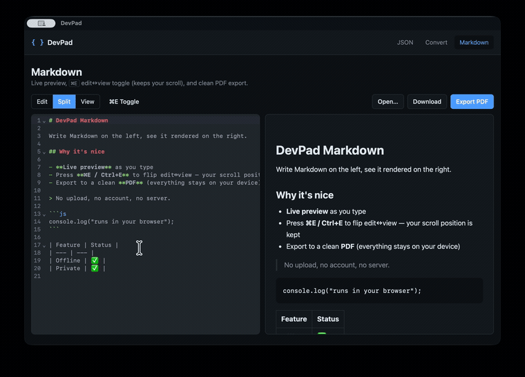
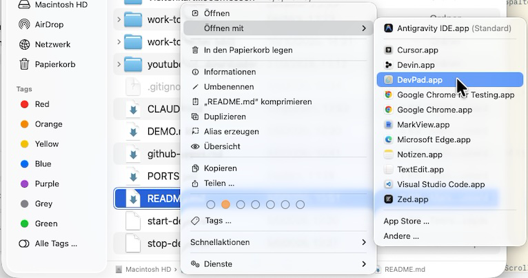

# DevPad — Gallery

Visual tour of DevPad running as the **native macOS app** (same UI ships on the web).
Everything runs locally — nothing is uploaded.

## The app

The macOS app is the same tool set as the website, wrapped in a tiny Tauri (Rust) shell —
offline by nature, and a handler for `.json` / `.md` files.

## JSON — format, validate, explore

Format, minify and validate JSON with precise line/column errors, validate against a JSON
Schema, and explore the document as a collapsible tree.

## Convert — JSON ↔ YAML ↔ CSV

Convert between JSON, YAML and CSV in any direction, live, in the browser.

## Markdown — live preview, ⌘E toggle, PDF export

Write Markdown with live preview, flip edit↔view with **⌘E** (your scroll position is
kept), and export a clean PDF.

## Opens your files natively

DevPad registers as a handler for `.json` and `.md` files — set it as the default and a
double-click in Finder opens the file straight in the matching tool.

> _Coming: a clip of double-clicking a `.md` file in Finder and DevPad opening it._
