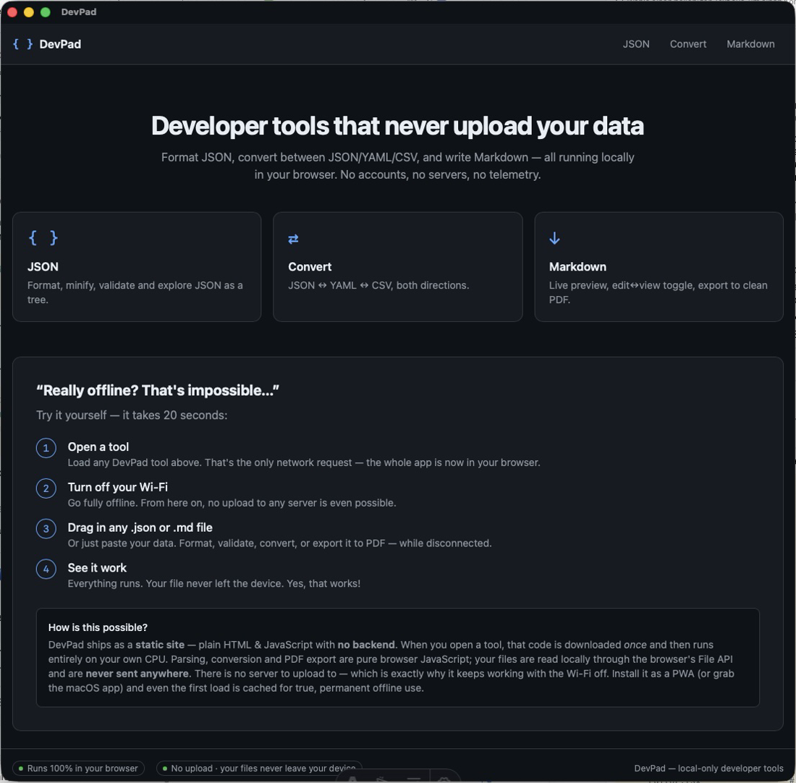

# DevPad

**Fast, offline, local-only developer tools — JSON, YAML, CSV and Markdown — that run entirely in your browser, and ship as a native macOS app from the same codebase.**

No accounts. No servers. No telemetry. Your files never leave your device.

> _Live demo:_ _(deploy pending)_ · _macOS app:_ build a `.dmg` locally with `npm run tauri build` (see below)



_More screenshots & clips in **[Gallery.md](Gallery.md)**._

---

## Why DevPad

Developers reach for online JSON formatters and Markdown editors dozens of times a week — and routinely paste company data into random websites of unknown trustworthiness. DevPad does the common 80% of that work **without ever uploading anything**: all parsing, conversion and rendering happen on your own CPU, in pure browser JavaScript.

The same static build is wrapped by a **Tauri (Rust) shell** into a signed-able native macOS `.app` that registers as a handler for `.json`/`.md` files — so you can double-click a file in Finder and it opens straight in DevPad.

## “Really offline? That's impossible…”

It takes 20 seconds to prove:

1. **Open a tool** — that's the only network request; the whole app is now in your browser.
2. **Turn off your Wi-Fi** — from here on, no upload to any server is even possible.
3. **Drag in any `.json` or `.md` file** (or paste) — format, validate, convert, or export to PDF, while disconnected.
4. **See it work.** Your file never left the device.

**How?** DevPad is a *static site* — plain HTML & JavaScript with no backend. The code is downloaded once and runs locally; files are read through the browser's File API and never sent anywhere. A service worker caches the app shell, so it keeps working across reloads with the network off. (And the macOS app is offline by nature.)

## Features

- **JSON** — format, minify, validate (with precise line/column errors), validate against a **JSON Schema** (`ajv`), and explore as a collapsible **tree**.
- **Convert** — **JSON ↔ YAML ↔ CSV** in any direction. Nested values survive the CSV round-trip as JSON strings instead of `[object Object]`.
- **Markdown** — live preview, **⌘E / Ctrl+E edit↔view toggle that preserves your scroll position**, and **export to a clean PDF**.
- **Files** — open via native dialog / file picker, drag-and-drop, download, and (in the macOS app) save back to disk + double-click `.json`/`.md` to open.
- **Private & offline** — installable PWA; nothing is uploaded; works with the network off.

## Tech stack

| Area | Choice |
| --- | --- |
| Site / routing | **Astro** (static output, one route per tool for SEO) |
| Interactive UI | **React** islands |
| Editor | **CodeMirror 6** |
| Styling | **Tailwind CSS v4** |
| Transforms | `ajv` + `ajv-formats`, `js-yaml`, `papaparse`, `marked` + `DOMPurify` |
| Desktop | **Tauri v2** (Rust shell, `plugin-dialog` + `plugin-fs`) |
| Tests | **Vitest** (the transform core) |

The compute core (`src/lib/`) is framework-agnostic, pure TypeScript and unit-tested; the UI is a thin layer on top. The same static `dist/` is served on the web **and** wrapped by Tauri — a single codebase, two distribution surfaces.

## Project structure

```
src/
  lib/            # pure, tested transforms (no UI imports)
    json/         # format · validate (JSON Schema) · tree
    convert/      # yaml · csv
    markdown/     # render (+data-source-line) · scroll-sync · pdf
    files/        # io.ts (web ↔ Tauri) · tauri-open.ts (open-with handling)
  components/     # React islands: Editor, JsonTool, ConvertTool, MarkdownTool …
  pages/          # index · json · convert · markdown (Astro routes)
  layouts/        # Base.astro (SEO, nav, PWA registration)
src-tauri/        # Tauri v2 Rust shell: file associations, native open/save
public/           # manifest.webmanifest, sw.js (offline), favicon
```

## Develop

```bash
npm install
npm run dev        # web app at http://127.0.0.1:4600  (see ../PORTS.md)
npm run test       # run the transform-core unit tests
npm run build      # static site → dist/
npm run preview    # serve the production build (service worker active)
```

### macOS app (Tauri)

Requires the Rust toolchain (`rustup`) and Xcode Command Line Tools.

```bash
npm run tauri dev            # run the native app against the dev server
npm run tauri build          # release .app + .dmg
npm run tauri build -- --debug   # faster, unsigned build for local testing
```

Artifacts land in `src-tauri/target/<profile>/bundle/`. The app registers as a handler for `.json` and `.md`/`.markdown` files; double-clicking one opens it in the matching tool.

> **Distribution note:** a `.dmg` for other Macs needs Apple code-signing + notarization (Apple Developer Program). Unsigned local builds are fine for personal use; without notarization other users hit Gatekeeper.

## Privacy / GDPR

Because every byte stays on the device, DevPad has **no personal-data processing, no third-party requests, and no cookies/consent surface** — a clean fit for privacy-conscious EU workflows.

## Roadmap

- JSON diff (two-pane) and JSONPath query
- Code-signed, notarized `.dmg` release
- More converters (TOML, XML)

## License

MIT
